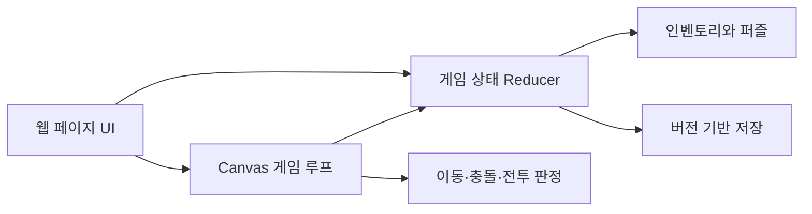

# Website Escape Game

가상의 웹 브라우저 안에서 여러 페이지를 탐색하고 아이템과 단서를 조합해 탈출 조건을 찾는 1인 웹 게임 프로젝트입니다. 3일 동안 기획부터 게임 로직, UI, 테스트와 최종 통합까지 진행했습니다.

## 핵심 정보

> [웹에서 바로 플레이](https://mindarinda47.github.io/website-escape-game/) · [플레이 영상](https://youtu.be/Y9AoMUE8m2I)

| 항목 | 내용 |
|---|---|
| 형태 | 1인 프로젝트 |
| 개발 기간 | 약 3일 |
| 담당 | 기획, 상태 설계, 게임 로직, UI 구현, 테스트, 최종 통합 |
| 기술 | React, TypeScript, Vite, Canvas 2D, Vitest |

## 구현 기능

- 가상 브라우저의 페이지 이동과 방문 기록
- 여러 웹 페이지에 분산된 퍼즐과 아이템 연동
- 인벤토리와 전역 게임 상태 관리
- Canvas 기반 이동, 충돌, 적, 투사체와 보스 패턴
- 버전이 있는 로컬 저장 데이터와 손상 데이터 복구
- 기능 수행 순서가 달라도 일관성을 유지하는 상태 전환

## 대표 코드 바로가기

| 영역 | 코드 | 확인할 내용 |
|---|---|---|
| 전역 상태 | [`gameReducer.ts`](src/state/gameReducer.ts) | 퍼즐·아이템·이벤트 상태 전환 |
| 저장 | [`persistence.ts`](src/state/persistence.ts) | 버전 확인, 기본값 병합과 손상 데이터 복구 |
| Canvas 게임 | [`AdventureCanvas.tsx`](src/minigame/AdventureCanvas.tsx) | 입력, 게임 루프, 충돌, 전투와 화면 출력 연결 |
| 시뮬레이션 | [`engine.ts`](src/minigame/engine.ts) | 이동·충돌·전투 규칙 |
| 회귀 테스트 | [`sportsSimulation.test.ts`](src/test/sportsSimulation.test.ts) | 선수 행동과 공 소유권 전환 검증 |

## 대표 설계

브라우저 이동, 퍼즐 진행과 인벤토리 상태는 reducer에서 관리하고, 프레임 단위 이동·충돌·전투는 Canvas 게임 루프에서 처리합니다. 저장 계층은 UI 상태와 분리해 이전 버전이나 손상된 데이터가 전체 게임 실행을 막지 않도록 구성했습니다.

자세한 상태 구조는 [Architecture](docs/architecture.md)에서 확인할 수 있습니다.

## 대표 문제 해결

- 벽 뒤의 플레이어까지 공격 대상으로 판단하던 문제를 충돌 정보와 공간 조건 검사로 제한했습니다.
- 적이나 충돌 지형 가까이에 생성될 수 있던 문제를 후보 위치의 안전 조건 평가로 해결했습니다.
- 이전 버전 또는 손상된 저장 데이터는 버전 확인과 기본값 병합을 거쳐 복구하도록 구성했습니다.
- 축구 시뮬레이션에서 여러 선수가 공에 동시에 접근해 진행이 정체되던 문제를 공과의 거리, 우선 행동 선수, 포메이션 유지와 빈 공간 이동 규칙으로 분리했습니다.

구현 배경은 [Problem Solving](docs/problem-solving.md)에 정리했습니다.

## 테스트 구성과 공개 범위

- Vitest 테스트 파일 6개, 자동화 테스트 33개
- 상태 전환, 저장 복구, 전투·축구 시뮬레이션 검증 코드 포함

게임플레이 코드와 설계 문서를 공개하며 이미지·음원 리소스는 포함하지 않습니다. 소스의 에셋 참조는 유지하므로 이 저장소만으로 전체 빌드·실행 및 에셋 의존 테스트를 수행할 수 없습니다. 완성된 게임은 위 플레이 링크에서 확인할 수 있습니다.
