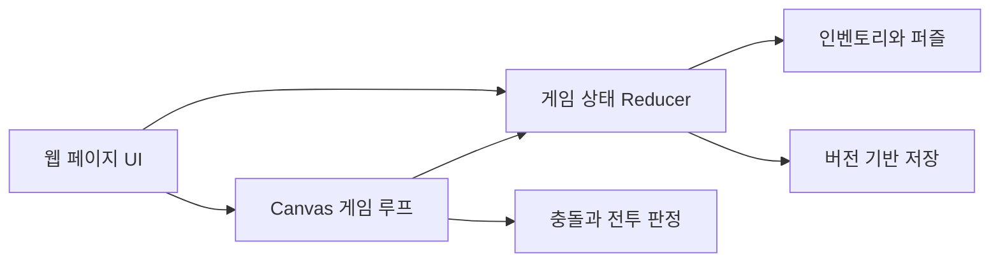

# 구조 설명

## 상태 계층

1. 브라우저 상태: 현재 페이지, 이동 기록, 페이지 전환
2. 게임 상태: 획득 아이템, 퍼즐 진행, 구매 및 이벤트 상태
3. 미니게임 상태: 플레이어, 적, 투사체, 충돌, 보스 패턴
4. 저장 상태: 버전 정보, 체크포인트, 복구 가능한 기본값

상태 변경은 reducer를 중심으로 모으고, Canvas 게임 루프는 프레임 단위 시뮬레이션을 담당합니다. 저장 계층은 UI 상태와 분리하여 손상된 데이터가 전체 게임 실행을 막지 않도록 구성했습니다.

## 주요 흐름

